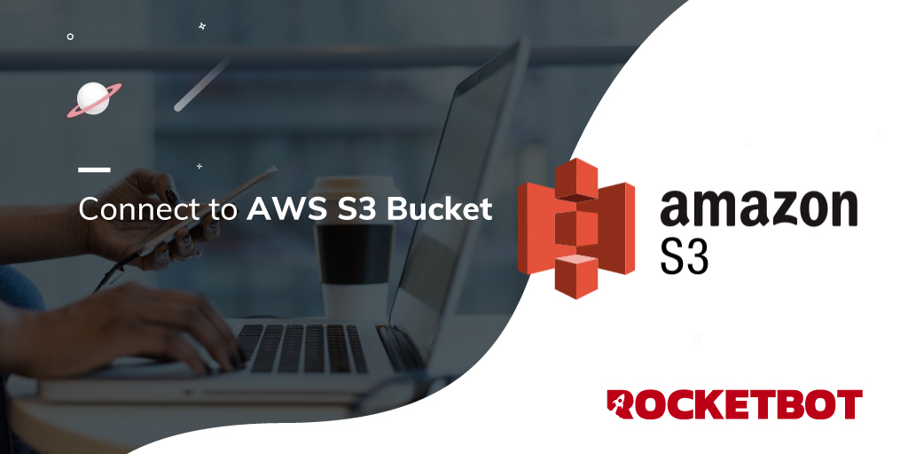

# AWS_S3
  
Módulo para conectar ao AWS S3 Bucket 
  

## Como instalar este módulo
  
__Baixe__ e __instale__ o conteúdo na pasta 'modules' no caminho do Rocketbot  

## Descrição do comando

### Conexão com Aws
  
Insira os dados para a conexão
|Parâmetros|Descrição|exemplo|
| --- | --- | --- |
|Nome do Host / IP|Endereço do servidor ao qual se conectar||
|Secret Access Key|Nome do usuário||
|Atribuir resultado à variável|Variável onde será armazenado o estado da conexão, retorna True se for bem sucedida ou False caso contrário|Variable|

### Obter Lista de Buckets
  
Obter Lista de Buckets
|Parâmetros|Descrição|exemplo|
| --- | --- | --- |
|Atribuir resultado à variável|Variável onde será armazenada a lista obtida|Variable|

### Obter lista de objetos em um bucket
  
Insira os dados para a conexão
|Parâmetros|Descrição|exemplo|
| --- | --- | --- |
|Nome do Bucket|Nome do bucket|name_bucket|
|Atribuir resultado à variável|Variável onde será armazenada a lista de objetos|Variable|

### Subir um Arquivo
  
Subir um arquivo para um bucket
|Parâmetros|Descrição|exemplo|
| --- | --- | --- |
|Archivo|Selecione o arquivo a subir||
|Nome com o qual o arquivo será subido||new_name|
|Nome do bucket||name_bucket|
|Atribuir resultado à variável|Variável onde o resultado será armazenado|Variable|

### Donwload Arquivo
  
Download arquivo de um Bucket
|Parâmetros|Descrição|exemplo|
| --- | --- | --- |
|Nome do Objeto||name_object|
|Nome do Bucket||name_bucket|
|Caminho de Arquivo||file_path|
|Atribuir resultado à variável|Variável onde será armazenado o resultado|Variable|
